# 🚀 MVP Deployment System

> **Transform natural language ideas into fully deployed applications in minutes, not months.**

[](https://aws.amazon.com/)
[](https://reactjs.org/)
[](https://www.typescriptlang.org/)
[](https://aws.amazon.com/cdk/)

---

## 📋 Overview

This revolutionary system transforms natural language MVP descriptions into fully functional, production-ready applications. From idea to deployment in under an hour, with complete frontend and backend infrastructure automatically generated and deployed to AWS.

### ✨ Key Features

- 🎯 **Natural Language Input** - Describe your MVP in plain English
- ⚡ **Lightning Fast** - Complete deployment in under 60 minutes
- 🤖 **AI-Powered** - Lovable.dev frontend + AWS Q CLI backend generation
- 🏗️ **Infrastructure as Code** - AWS CDK with TypeScript
- 🔄 **Automated CI/CD** - GitHub Actions deployment pipeline
- 📊 **Production Ready** - Monitoring, logging, and testing included

---

## 🎯 How It Works

```mermaid
graph LR
    A[💡 User Idea] --> B[📝 FrontSpec Generation]
    B --> C[🎨 Lovable.dev Frontend]
    C --> D[🏗️ AWS Infrastructure]
    D --> E[🔍 Code Analysis]
    E --> F[📋 Backend Spec]
    F --> G[🤖 Q CLI Backend]
    G --> H[🔗 API Integration]
    H --> I[🚀 Deploy & Test]
    I --> J[✅ Live MVP!]
    
    style A fill:#e1f5fe
    style J fill:#c8e6c9
```



---

## 🧾 Step-by-Step Workflow

### 1️⃣ **User Submission** 
> *"I want a task management app for remote teams"*

- User submits MVP idea in natural language
- System captures requirements and context

### 2️⃣ **Domain Purchase**
- Purchase domain and configure DNS settings
- Set up Route 53 hosted zone

### 3️⃣ **FrontSpec Prompt Generation**
- Internal LLM converts description into structured **Lovable.dev prompt**
- Uses standardized [`FrontSpec`](frontspec/README.md) DSL template
- Ensures deterministic, one-shot generation

### 4️⃣ **Frontend Creation** ⚡ *1-2 minutes*
- **Lovable.dev** generates React/Next.js frontend
- Exports clean, production-ready code to GitHub
- Includes responsive design and modern UI components

### 5️⃣ **Frontend Infrastructure Setup** ⚡ *2-3 minutes*
- **AWS CDK** deploys static site infrastructure:
  - 🗄️ **S3 bucket** with private access
  - 🌐 **CloudFront** distribution with OAC
  - 🔒 **ACM certificate** for HTTPS
  - 🎯 **Route 53** DNS configuration
- **GitHub Actions** workflow for automated deployment
- SPA routing support with fallback to `index.html`

### 6️⃣ **Frontend Analysis & FrontSpec Population** ⚡ *30 seconds*
- Analyze generated frontend codebase
- Extract routes, components, and API calls
- Generate complete `frontspec.yaml` file
- Capture style tokens and data bindings

### 7️⃣ **Backend Specification Generation** ⚡ *30 seconds*
- Extract backend requirements from FrontSpec
- Identify required API routes and data models
- Generate structured `backend-spec.json`
- Group routes into logical services

### 8️⃣ **Backend Implementation** ⚡ *2-3 minutes*
- Convert `backend-spec.json` to natural language prompt
- **AWS Q Developer CLI** generates complete backend:
  - 🏗️ **CDK infrastructure** in TypeScript
  - 🐍 **Lambda functions** in Python
  - 🔐 **IAM permissions** and security
  - 🌐 **CORS** and input validation
- [Q CLI handles deployment, testing, and documentation](https://community.aws/content/2uVl543Irg1pNRSkGY4yvth7Tmw/build-serverless-genai-apps-faster-with-amazon-q-developer-cli-agent)

### 9️⃣ **Frontend API Integration** ⚡ *1-2 minutes*
- Update frontend with real backend endpoints
- Inject `VITE_API_URL` environment variable
- Replace placeholder calls with actual API integration
- Remove unused mocks and stubs

### 🔟 **Full Stack Deployment & Testing** ⚡ *2-3 minutes*
- Deploy frontend and backend to AWS
- Configure DNS and SSL certificates
- Run comprehensive smoke tests
- Generate deployment reports and live URLs

---

## 📁 Project Architecture

```
overnight-mvp/
├── 🎨 frontend/                    # Lovable.dev generated React app
├── 🏗️ lib/                        # CDK infrastructure stacks
│   ├── FrontendStack.ts           # S3 + CloudFront setup
│   ├── CertStack.ts              # ACM certificate management
│   └── DnsStack.ts               # Route 53 DNS configuration
├── 🚀 bin/
│   └── app.ts                    # CDK application entry point
├── ⚡ .github/workflows/
│   └── deploy.yml                # Automated deployment pipeline
├── 📋 frontspec/
│   └── README.md                 # FrontSpec DSL documentation
├── 📝 1-aws-static-site-prompt.md
├── 🎯 2-frontspec-template.yaml
├── 🔍 3-populate-frontspec-prompt.md
├── 📋 4-backend-spec-prompt.md
└── 🤖 5-backend-implementation-prompt.md
```

---

## 🎁 Deliverables

### 📦 **Frontend Repository**
- Complete React/Next.js application
- AWS S3 + CloudFront deployment
- Responsive, modern UI design
- Production-ready build pipeline

### 🔧 **Backend Repository**
- Q CLI generated API Gateway + Lambda
- Complete REST API implementation
- OpenAPI specification
- Comprehensive documentation

### 📋 **Configuration Repository**
- FrontSpec and BackendSpec files
- LLM prompts and responses
- Deployment logs and infrastructure code
- OpenAPI schema and DNS records
- Live URLs and test reports

---

## 🛠️ Technology Stack

| Component | Technology | Purpose |
|-----------|------------|---------|
| **Frontend** | React/Next.js (Lovable.dev) | User interface generation |
| **Backend** | AWS API Gateway + Lambda (Q CLI) | Serverless API generation |
| **Infrastructure** | AWS CDK (TypeScript) | Infrastructure as code |
| **Deployment** | GitHub Actions + S3/CloudFront | Automated CI/CD |
| **DNS** | Route 53 + ACM | Domain and SSL management |
| **Specification** | FrontSpec DSL (YAML) + BackendSpec (JSON) | Structured requirements |
| **Backend Generation** | AWS Q Developer CLI | Automated backend creation |

---

## 🚀 Getting Started

### Prerequisites
- AWS Account with appropriate permissions
- GitHub repository
- Domain name (optional)

### Quick Start
1. **Clone this repository**
   ```bash
   git clone https://github.com/your-org/overnight-mvp.git
   cd overnight-mvp
   ```

2. **Install dependencies**
   ```bash
   npm install
   ```

3. **Configure AWS credentials**
   ```bash
   aws configure
   ```

4. **Follow the [NEXT.md](NEXT.md) implementation guide**

---

## 🔮 Future Roadmap

### 🎯 **Phase 1: Core Features**
- [ ] Agent workflow orchestration (Strands SDK, Bedrock, n8n)
- [ ] Contact center auto-deployment via Amazon Connect
- [ ] Auth integration (Cognito, Clerk, Auth0)

### 🚀 **Phase 2: Developer Experience**
- [ ] Custom CLI tool (`overnight-mvp`)
- [ ] Preview environments for staging
- [ ] Multi-environment support (dev/staging/prod)

### 🏢 **Phase 3: Enterprise Features**
- [ ] Multi-tenant support
- [ ] Compliance frameworks (SOC2, GDPR, HIPAA)
- [ ] Advanced monitoring and analytics

---

## 🤝 Contributing

We welcome contributions! Please see our [Contributing Guide](CONTRIBUTING.md) for details.

### Development Setup
1. Fork the repository
2. Create a feature branch
3. Make your changes
4. Add tests
5. Submit a pull request

---

## 📄 License

This project is licensed under the MIT License - see the [LICENSE](LICENSE) file for details.

---

## 🙏 Acknowledgments

- **Lovable.dev** for frontend generation
- **AWS Q Developer CLI** for backend automation
- **AWS CDK** for infrastructure as code
- **GitHub Actions** for CI/CD automation

---

<div align="center">

**Built with ❤️ by the Overnight MVP Team**

[](https://github.com/your-org/overnight-mvp)
[](https://github.com/your-org/overnight-mvp)
[](https://github.com/your-org/overnight-mvp/issues)

</div>
